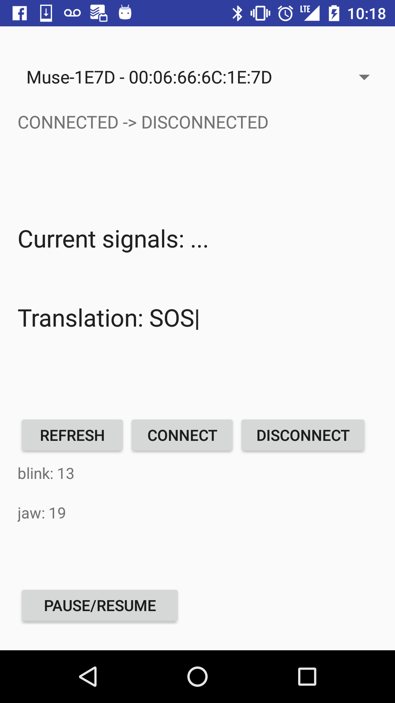

# muse-code

Muse Code is a hands-free communication Android app using Morse code and the Muse brain-sensing headband (http://dev.choosemuse.com/android).

The app translates detected blinks to dots and jaw clenches to dashes, and nodding sends the Morse code to be translated into letters. In addition, tilting the head left clears the currently queued signals, or, if the queue is empty, it deletes the last character. Tilting one's head up calls Google's text-to-speech API to read the text.

Team: Liam Kelly, Stanley Xiang, Kevin Yang, Yunhua Zhao

Video:

https://www.youtube.com/watch?v=uRCgeQAklmw

Screenshot:

